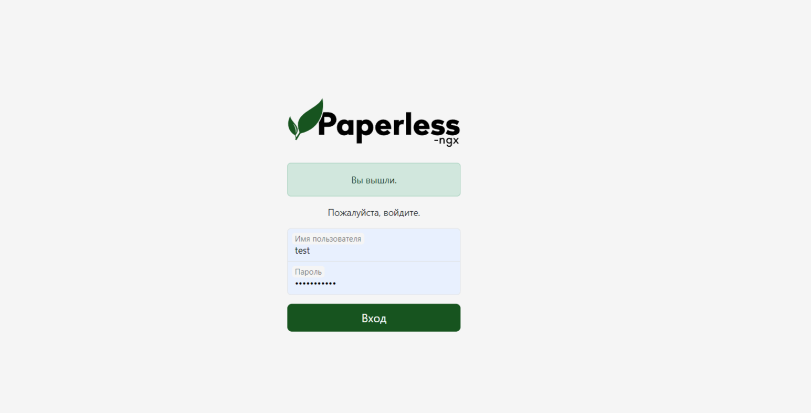
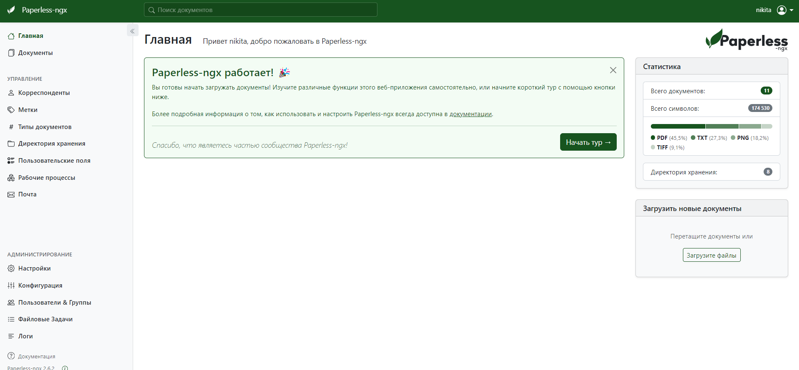
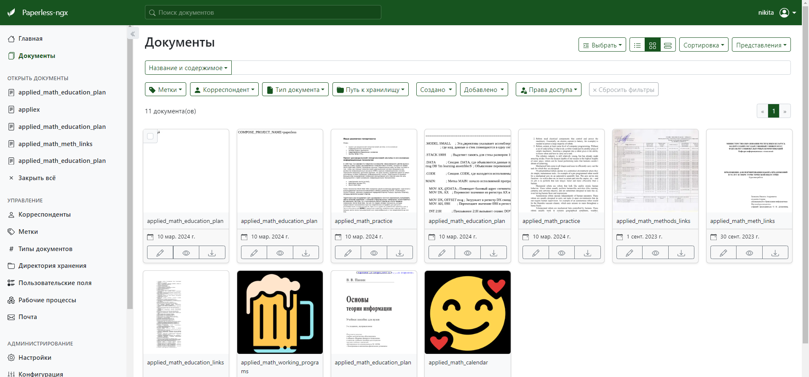
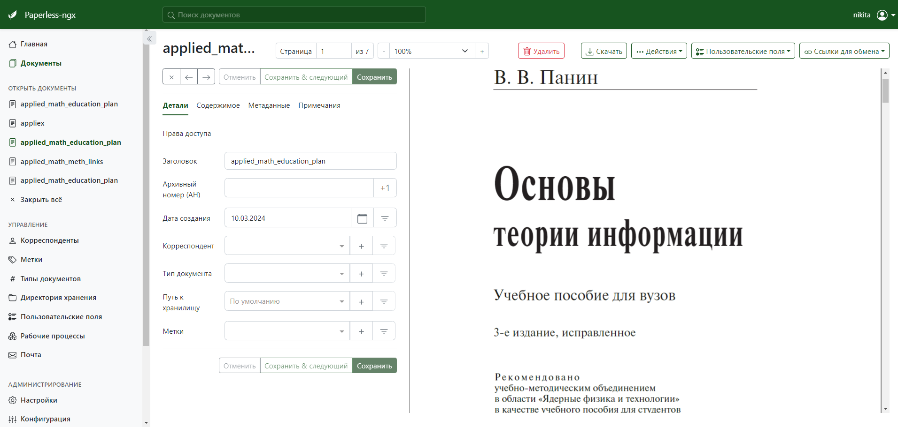
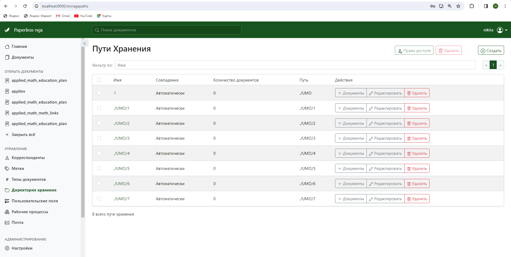
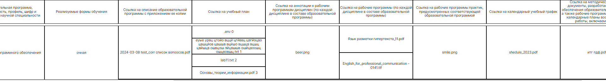
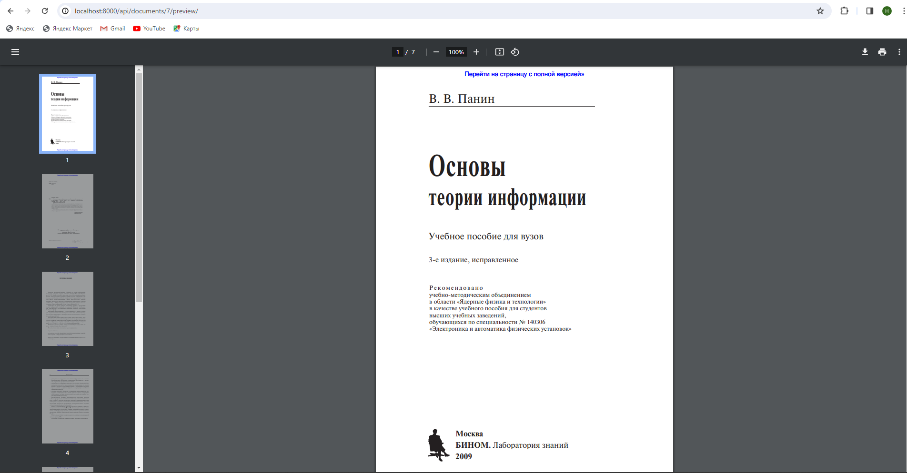

#  Cloud storage of Belarusian-Russian-University of different faculties
## Getting Started
First, run the development server:
```bash
#use npm 
npm install
npm run dev
# or
#use yarn
yarn install
yarn run dev
```
In order to you need Docker to run the server. Run the command:

```bash
docker build -t my-paperless . #create an image of project
#then run 
docker-compose up -d #this will run storage server  (paperless-ngx)
```

## If you completed everything successfully, then you can open the local server in the browser on port 8000 (http://localhost:8000/):


## Here you need to sign up for locale storage server account. In order to sign up run command in the root directory of the project (after running this command enter required information):
```bash
docker compose run --rm webserver createsuperuser
```
## After this actions you can sign in your paperless-ngx account:

## On the right side you can download different types of documents
## You can also see all yours downloaded documents and change them:



## You can also see set up store folders:

## In order to allow sending requests from different server to localhost:8000 add this in docker-compose.env file:
```bash
PAPERLESS_CORS_ALLOWED_HOSTS=http://localhost:8000,http://localhost:3000 #localhost:8000 - paperless-ngx server, localhost:3000 your server
```

# documentation of paperless-ngx:
- ## [Docker Hub](https://docs.paperless-ngx.com/setup/#docker_hub)
- ## [Configuration](https://docs.paperless-ngx.com/configuration/)
- ## [Main docunemtation](https://docs.paperless-ngx.com/)
- ## [API](https://docs.paperless-ngx.com/api/)

# paperless-ngx github repository: 
# [Paperless-ngx repository](https://github.com/paperless-ngx/paperless-ngx) 🔗
## Table on client side:

## If you click on any cell with a document you will be redirected to the pdf page of the document:

